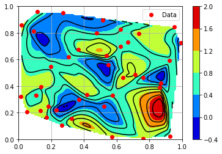

# 插值Interpolate  

工作中做数据分析时偶尔会用到二维数据的插值计算，这里简要记录一下`griddata` 方法：  
`scipy.interpolate.griddata(points, values, xi, method='linear', fill_value=nan, rescale=False)`  
- `points`: 长度为n 的D 维（列）数组(ndarray, N-dimensional array)，或者是元组。相当于采样输入  
- `values`: 相当于采样的值  
- `xi`: 待插值的输入点  
- `method`: 
  - `nearest` 最近 
  - `linear` 线性 
  - `cubic` 高阶  
- `fill_value`: 超过插值范围的值填充  
- `rescale`：缩放，可选  
- 返回插值后的数据  

一般按时间采样的数据只需要简单的分列后就可以直接作为参数送入`griddata` 函数，但是如果要绘制三维空间的平面图或者等高线图，还需要更多的细节。  

## 等高线图  

做等高线图前需要对输入进行`mesh` 处理，以确保输入点的均匀覆盖：  
```python
import numpy as np
N = 100
Ni = 40
Pi = np.random.rand(Ni, 2)  # 模拟采样值x,y  
Zi = np.random.rand(Ni)     # 模拟采样值z

x = np.linspace(0., 1., N)  # 
y = np.linspace(0., 1., N)  # 
X, Y = np.meshgrid(x, y)
P = np.array([X.flatten(), Y.flatten() ]).transpose()  
# 这里得到的P 可以作为xi 输入到griddata

Z_nearest = griddata(Pi, Zi, P, method = "nearest").reshape([N, N])  # 将得到的输出重新变形成NxN 的矩阵  

# 绘制等高线图
plt.contourf(X, Y, Z_nearest, 50)  
# X，Y，Z 为NxN 的矩阵  
# levels=50，也可为数组，表示等高线的数量 
plt.plot(Xi, Yi, "or", label = "Data")
plt.colorbar()
plt.legend()
plt.grid()
plt.show()
```  

## 示例  

以[参考资料](https://www.osgeo.cn/scientific-python/notebooks_rst/1_Interpolation/2D_Interpolation.html)中的代码节选为例：  
```python
# %%
import numpy as np  
import matplotlib as mpl
from mpl_toolkits.mplot3d import Axes3D
import matplotlib.pyplot as plt

Ni = 40
Pi = np.random.rand(Ni, 2)
Xi, Yi = Pi[:,0], Pi[:,1]
Zi = np.random.rand(Ni)


# # 绘制三维散点图  
# fig = plt.figure()
# ax = fig.gca(projection='3d')
# ax.plot(Xi, Yi, Zi, "or", label='Data')
# ax.legend()
# ax.set_xlabel('x')
# ax.set_ylabel('y')
# ax.set_zlabel('z')
# plt.show()

#%% 
N = 100
x = np.linspace(0., 1., N)
y = np.linspace(0., 1., N)
X, Y = np.meshgrid(x, y)
P = np.array([X.flatten(), Y.flatten() ]).transpose()

from scipy.interpolate import griddata
Z_nearest = griddata(Pi, Zi, P, method = "cubic").reshape([N, N])
plt.contourf(X, Y, Z_nearest, 5, cmap = mpl.cm.jet)       # 绘制最近插值的结果，没有等高线
plt.colorbar()  # 通过调用colorbar 预防legend 颜色丢失   

plt.contour(X, Y, Z_nearest, 10, colors = "k")   # 绘制等高线，但是会导致legend 颜色丢失

plt.plot(Xi, Yi, "or", label = "Data")  # 绘制点
plt.legend()
plt.grid()
plt.show()
# %%
```  

可以绘制如下等高线图：  



# 参考资料  
1. [二维插值（及以上）](https://www.osgeo.cn/scientific-python/notebooks_rst/1_Interpolation/2D_Interpolation.html)  
2. [matplotlib.pyplot.contourf](https://matplotlib.org/stable/api/_as_gen/matplotlib.pyplot.contourf.html)  
3. [scipy.interpolate.griddata](https://docs.scipy.org/doc/scipy/reference/generated/scipy.interpolate.griddata.html)

